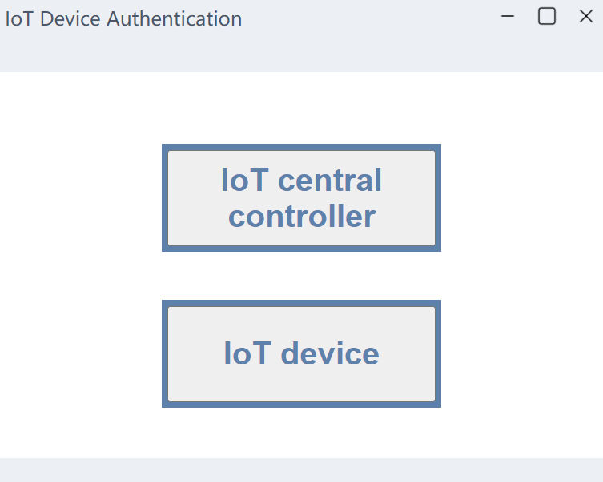
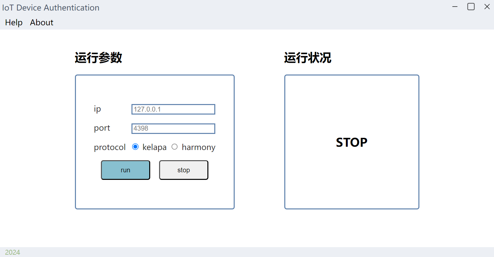
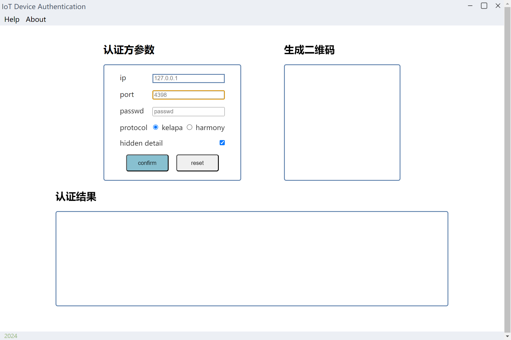
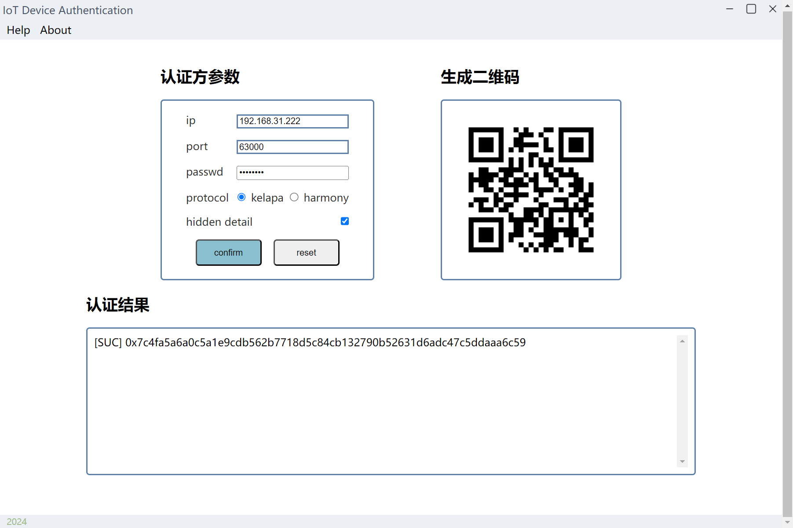

## Introdunction

我们实现了一个新的物联网认证方案Kelapa.该方案相对Open Harmony的认证方案,减少了协议交互次数并降低了数据传输量,显著提升了通信效率.

本仓库实现了两种物联网认证协议,包含:
- Open Harmony 所实现的认证方案.
- 我们的方案: Kelapa

代码包括两部分:

- 基于python实现认证协议交互流程, 并以命令行程序展现.

- 基于electron为认证程序实现简介的图形界面,便于用户使用.

## Repository contains
- benchmark 包含程序效率测试数据与可视化脚本
    - *.csv: 主程序测试模式生成的csv文件(可能包含)
    - show.py:用于对比两种认证协议的运行效率

- protocol 基于Python的认证协议命令行程序实现源代码
    - common              公共函数
    - requirements.txt    Python依赖库文件
    - progServer.py       主控设备程序
    - progClient.py       物联网设备程序
    - protocol_harmony.py Open Harmony认证协议实现
    - protocol_kelapa.py  Kelapa认证协议实现

- electronSrc 基于Electron的图形化认证界面源代码

## Usage
### U1 仅使用Python命令行程序
使用前要求依赖R1、R2、R3均已满足.
`protocol`路径下包含了物联网主控设备和物联网设备下命令行程序,使用方法如下:

**对于物联网控制设备**
```shell
Usage:
    python progServer.py [options]

Options:
    --ip <ip>               Specify the IP address. (default "127.0.0.1")
    --port <port>           Specify the port.       (default "4398")
    --protocol <protocol>   Specify the protocol.   (default "kelapa")
    <--debug>               Print protocol parameters.
```
对于主控设备,可使用选项为该命令行程序指定IP地址、端口和认证协议,并且可以决定是否输出协议内部运行参数.


**对于物联网设备**
```shell
Usage:
    python progClient.py [options]

Options:
    --ip <ip>               Specify the IP address. (default "127.0.0.1")
    --port <port>           Specify the port.       (default "4398")
    --passwd <password>     Specify the password.   (defalut "passwd")
    --protocol <protocol>   Specify the protocol.   (default "kelapa")
    <--benchmark>           Record time cost.
    <--debug>               Print running details.
```
对于物联网设备,可为该命令行程序指定IP地址、端口、认证协议和认证口令,并且可以决定是否输出协议内部运行参数,以及是否启用测试模式.

> 测试模式下会进行大量认证测试,并记录每次测试的认证时间,用于评估认证协议性能.
> 该模式生成的csv文件会保存在`benchmark`路径下,此时可以使用同路径下的`show.py`脚本直观对比两认证协议的运行效率.


**使用案例**

- 在本地地址(127.0.0.1)上测试认证协议.

    在测试设备中直接运行
    ```shell
        python progServer.py
        python progClient.py
    ```
- 物联网设备在局域网(192.168.31.0/24)中运行认证协议.

    已知主控设备IP地址为`192.168.31.100`,则主控设备运行:
    ```shell
        python progServer.py --ip 192.168.31.100
    ```
    物联网设备运行:
    ```shell
        python progClient.py --ip 192.168.31.100
    ```


### U2 使用GUI操作认证程序
使用前要求依赖R1、R2、R3、R4均已满足.


进入`electronSrc`路径下,并运行
```shell
npm run start
```

运行程序后会进入初始化界面,选择当前设备类型.



若选择"IoT主控设备",则进入主控设备界面,此时可以输入**主控设备**的IP地址和端口,并选择认证协议,点击"run"按钮即可开始认证流程.



若选择"IoT设备",则进入物联网设备界面,此时需要输入**主控设备**的IP地址、端口和认证口令,并选择认证协议,点击"run"按钮即可开始认证流程.



程序运行后,程序会生成认证口令对应的二维码并显示在界面上,此时可以使用手机扫描二维码进行认证.运行结束后,程序会在"认证结果"中显示是否认证成功,若是成功还会显示对应的会话密钥.



除此之外,可以在物联网设备端通过取消勾选"hidden detail"来展示协议执行过程中的实际参数值.


## Required dependencies

### R1: Software
依赖软件:
- python
- gmp
- mpc


**for Ubuntu20.04**
```shell
sudo apt install gcc g++ git build-essentials cmake python python3-pip libzbar-dev npm
```

**for Raspberry Pi 4**
```shell
sudo apt install gcc g++ git cmake python libgmp3-dev libmpfr-dev libmpc-dev
```


### R2: GmSSL
已测试版本: GmSSL-3.1.1

**for Ubuntu20.04**

```shell
git clone https://gitee.com/mirrors/GmSSL.git
cd ./GmSSL/
mkdir build
cd build
cmake ..
make
make test
sudo make install
```

**for windows**

从[github](https://github.com/guanzhi/GmSSL)上下载GmSSL[安装包](https://github.com/guanzhi/GmSSL/releases/download/v3.1.1/GmSSL-3.1.1-win64.exe)并安装.

将GmSSL动态库的路径加入环境变量,默认情况下动态库路径为:
```
C:\Program Files\GmSSL 3.1.1\bin
```


### R3: Python packages

**for Ubuntu20.04**
在`protocol`路径下运行
```shell
pip install -r requirements.txt
```

**for Raspberry Pi 4**
当系统要求使用虚拟环境,则替换为如下命令:
```shell
cd ./protocol
python -m venv venv
source ./venv/bin/activate
pip install -r requirements.txt
```


### R4: electron
确保已安装`npm`后进入`electronSrc`路径.

首先安装electron项目所需依赖:
```shell
npm install
```

随后即可运行GUI.
```shell
npm run start
```

## 
